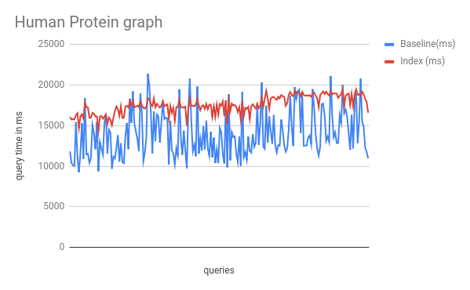
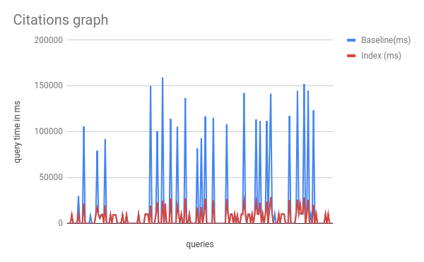
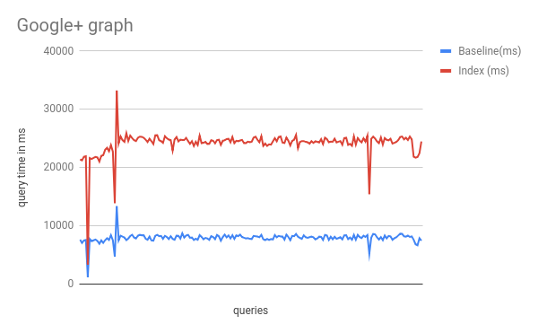
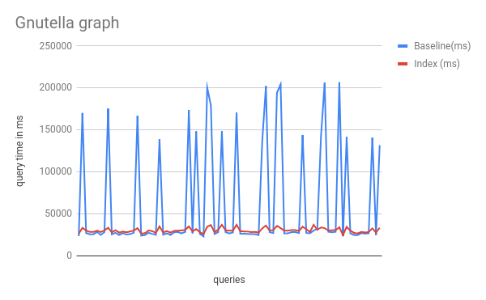
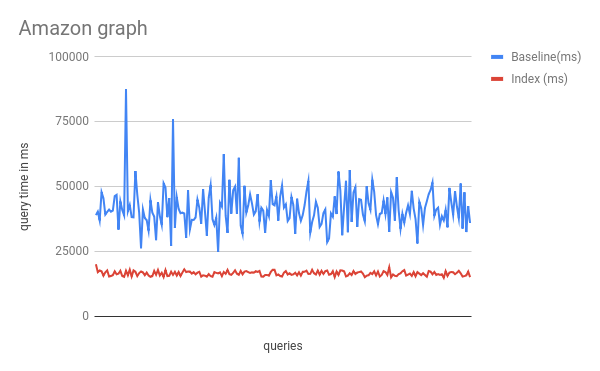
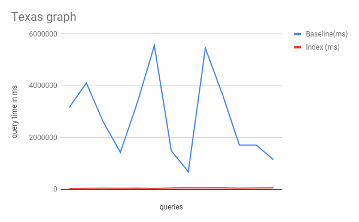

= *Reachability Indexing for Neo4j - Bloom4Neo*
:toc: macro

Matthias Richter

Zoltán Ruzsik

Sebastian Jannasch

Contents

toc::[]

== Abstract
:toc: macro

A reachability query which answers the question if a node is reachable from another node in a graph can be a costly operation especially in large graphs. Much research has been done to improve the query time. One approach is the implementation of a reachability index that helps to answer the reachability query faster and with less computation needed.

In this document we want to answer the question if reachability indexing with Bloom filters especially for reachability queries between two sets of nodes in the graph database management system Neo4j is a practicable solution or not. Therefore two versions of reachability indexing and reachability querying were implemented and evaluated. A simple prototype-like solution to test the concept of reachability indexing in Neo4j and a solution based on the paper _Reachability Querying: Can It Be Even Faster?_ published in the IEEE Transactions on Knowledge and Data Engineering Volume 29, Issue 3, March 1 2017 (Link: https://ieeexplore.ieee.org/document/7750623/[https://ieeexplore.ieee.org/document/7750623/]). Both implementations use a Bloom filter based approach with special treatment for strongly connected components. 

We show how how an Bloom filter based reachability index in Neo4j can be implemented with user defined procedures and functions. We show that the speedup achieved by the index queries can be very different among various graphs, ranging from 0.33 to 30.28 for the graphs we examined.

== Introduction

A reachability query which answers the question if a node is reachable from another node in a graph can be a costly operation especially in large graphs. Much research has been done to improve the query time for example the implementation of an reachability index that helps to answer the reachability question faster and with less computation needed.

One approach is to construct an complete index holding the reachability information for every node pair. Doing this the size of the index can become quite large when big graphs are involved. Assume you have n = one million nodes in your graph you need to store the information of reachability for n² = one trillion pairs of nodes. Assuming you only need one bit per pair (true or false) the size of the index would be 125 Gigabytes and therefore probably much larger than the graph itself. 

To solve this problem one can implement an reachability index using Bloom filters which give a tradeoff between index size and computational effort. The paper _Reachability Querying: Can It Be Even Faster?_ published in the IEEE Transactions on Knowledge and Data Engineering Volume 29, Issue 3, March 1 2017.footnote:[ https://ieeexplore.ieee.org/document/7750623/[https://ieeexplore.ieee.org/document/7750623/]

] describes that the Bloom filter approach shows better performance than reachability algorithms that do not use an index regarding the reachability between a pair of nodes. 

In this document we want to answer the question if the Bloom filter approach also shows better performance than baseline algorithms when reachability is checked between two sets of nodes. Therefore we want to compare a baseline reachability query with a reachability index based query in the graph database management system Neo4j. We want to implement the construction of an reachability index and the associated query. Based on that we want to determine the speedup that can be reached over the Neo4j baseline algorithm and we want to examine the size of the index.

The chapter _Concept_ will give an insight in the concept of the Bloom filter-based reachability index. The chapter _Implementation_ will present concrete information about the implementation of the index creation and the reachability queries. The chapter _Evaluation_ presents the results of our benchmarks. The chapter _Conclusion_ summarizes the results and the evaluation and the chapter _Future Work_ takes a look into how to improve the indexation.

== Concept

Our solution uses the Bloom filter-based indexing approach described in the paper to conduct reachability searches on directed graphs in Neo4j, ignoring relationship labels. 
+
A reachability searc _h Search(U,_ V) between two sets of nodes uses reachability querie _s Reach(u,_ v) to find pairs of reachable nodes (u,v | u∈U, v∈V _, Reach(u,_ v)=true). 

The approach described in the paper uses Bloom filter labeling with some additional steps to create the reachability index. To simplify the reachability search and treat all strongly connected components (SCCs) as one node from the view of reachability, the original graph is transformed into a directed acyclic graph (DAG) first. Then, a depth-first search is conducted starting from nodes with no incoming relationships.The results of the DFS (discovery and finishing times of nodes) are then used in two ways: as "interval labels" on each node which help terminate the reachability search earlier, and for “vertices merging” - grouping nodes together that are probably topologically close based on the post-order of the DFS. The hash function for a Bloom filter with a size of _s_ then assigns a number between 0 and s-1 to each group - this will be the reachability fingerprint of the nodes in the group. Reachability fingerprints _k_ are stored by setting the _k_ -th bit in a Bloom filter. Two Bloom filters are then computed for each node in the DAG: L ~in~ has the reachability fingerprints of all nodes that can reach it through its incoming relationships while L ~out~ has the reachability fingerprints of all nodes that can be reached through its outgoing relationships; both also include the node’s own fingerprint.

The reachability query _Reach(u,v)_ is then decided recursively as follows:

* If u was discovered before and finished after v by the original DFS (decided based on interval labels), v is reachable from u.
* Else, if v has successors that aren’t successors of u or u has predecessors that aren’t predecessors of v (L ~out~ (v) ⊈ L ~out~ (u) OR L ~in~ (u) ⊈ L ~in~ (v)), v is not reachable from u.
* Else, for all successors w of u that haven’t been checked yet, check _Reach(w,v)_ ; if any of those decide that v is reachable from w, v is reachable from u.
* Else, if v is not reachable from any successor of u, v is not reachable from u.

We have two implementations: 

* A prototype implementation (called “V1”) to test SCC handling and Bloom filters
* A more complex implementation with additional indexing information (called “V2”) which is based on the paper “Reachability Querying: Can it even be faster” published in the IEEE Transactions on Knowledge and Data Engineering Volume 29, Issue 3, March 1 2017 (Link: https://ieeexplore.ieee.org/document/7750623/[https://ieeexplore.ieee.org/document/7750623/]).

Both use a method of SCC handling that differs from the one in paper: instead of explicit DAG transformation, for each SCC a new node is created to represent its members and store their indexing information. Our solution will be benchmarked against the results of a “baseline query” that uses shortestPath(a)-[*]->(b) from Neo4j to find reachable pairs of nodes.

== Implementation

The implementations are written in Java using the Maven build system to build a plugin for Neo4j.footnote:[ as shown in Neo4j developer manual: https://neo4j.com/docs/developer-manual/current/extending-neo4j/procedures/#user-defined-procedures[https://neo4j.com/docs/developer-manual/current/extending-neo4j/procedures/#user-defined-procedures] ]. The plugin provides a user defined procedure (UDP) for constructing the index and a user defined function (UDF) for checking the reachability between a pair of nodes. The UDP and UDF can be called from Cypher.

=== V1 Prototype Implementation

Goal of the prototype implementation (called “V1”) is to get a proof of concept implementation of reachability indexing for Neo4j. The focus here is less on performance but more on the detection and representation of strongly connected components (also called cycles) and the concept of bloom-filters implemented in a graph database.

V1 provides the procedure _bloom4neo.createIndex_V1()_ for constructing the index and the function _bloom4neo.checkReachability_V1()_ for checking the reachability between a pair of nodes. The procedure and the function are defined in the class Indexer.

[.underline]#bloom4neo.createIndex_V1():#

The reachability-index is created in two steps using the classes CycleNodesGenerator and IndexGenerator. 

The first step is the treatment of cycles within the graph and is done by the functions implemented in the class CycleNodesGenerator. The treatment contains the detection of strongly connected components (cycles) with the help of algo.scc..footnote:[ Neo4j Graph Algorithms ALGO: https://neo4j.com/blog/efficient-graph-algorithms-neo4j/[https://neo4j.com/blog/efficient-graph-algorithms-neo4j/] 

For documentation on algo.scc see https://neo4j-contrib.github.io/neo4j-graph-algorithms/#_community_detection_strongly_connected_components[https://neo4j-contrib.github.io/neo4j-graph-algorithms/#_community_detection_strongly_connected_components]] With the information gained from this algorithm it is possible to create the special nodes that represent the cycles in the graph - the cycle representatives. Those cycle representatives have the label CYCLE_REP and the property cycleMembers that is an array containing the nodeIDs of all nodes that are part of the cycle. Each non-cycle-node that is part of a cycle gets a property called cycleRepID. This property holds the nodeID of the cycle-rep-node.

The second step is to create the actually index which contains the Bloom filter and is done by the functions implemented in the class IndexGenerator and BloomFilter. For each node two Bloom filter properties: _L_ _in_ and _L_ _out_ ~~ are calculated:

* _L_ _in_ contains the fingerprints of nodes that can reach this node
* _L_ _out_ contains the fingerprints of nodes that can be reached from this node

These properties are fixed-length strings that can contain “0” or “1” (e.g. 10011010). Reachability between two nodes will leave a fingerprint represented by the value “1” at a special position in the string. This position is calculated by a hash-function using the nodeID.

Following hash-functions are implemented and ready to use:

* Modulo		calculate modulo length of _L_ _in_ _/ L_ _out_
* String.hashCode()	uses the internal Java hash function
* SHA256-hash		uses the internal Java hash function on the encoded nodeID
* Murmur3		hash function based on multiply (MU) and rotate (R)

The hash function and the length of the Bloom filter can be configured in the BloomFilter class. The length must be a power of 2.

“Lin” and “Lout” are calculated for each node by testing the reachability to all other nodes.

The traversal of the nodes is done by breadth first search (BFS). 

[.underline]#bloom4neo.checkReachability_V1():#

This function uses the properties created by the procedure createIndex() and the functions implemented in the class BloomFilter to check reachability between two nodes.

The reachability query takes two nodes as an input and returns true if the second node can be reached from the first node. There are four different checks which are performed in sequence to decide reachability:

. Are both nodes the same node? - O(1) - when yes return true
. Are the nodes in the same cycle? (we know the cycle-rep-IDs)  - O(1) - when yes return true
. Is there fingerprint in the Bloom filter properties? - O(1) - when no return false
. There is a fingerprint, so reachability is possible. We need to check with breadth first search - this is more costly!

=== V2 Paper Implementation

The goal of version V2 is to fully implement the Bloom filter labeling approach from the paper (referred to as BFL+). BFL+ employs additional steps before calculating individual bloom filter labels: 

First, the graph to be indexed is converted into a DAG. For the purpose of “vertices merging” - dividing the graph into partitions that are treated as a single node by further indexing steps, as well as an additional “interval label” [L ~dis~ , L ~fin~ ] that helps terminate the reachability search earlier, a DFS is conducted: 
+
Starting from nodes with no incoming relationships, the discovery time ~Ld~ is and finishing time ~Lf~ in of each node in the DFS is stored as the interval label of the node, the sequence of the finished nodes is stored in a post-order.

Vertices merging is done by uniformly dividing the post-order into _d_ disjoint intervals, _d_ being a user-defined constant.

The Bloom filter hash function randomly assigns a number k between 0 and _s_ -1 to each interval, _s_ being the size of the Bloom filters in bits.

The Bloom filters [L ~in~ , L ~out~ ] of the nodes, realised as bit vectors, are then computed:

The hash value k of node n is added to its Bloom filter by setting the k-th bit in L ~out~ of n.

For each successor of n whose L ~out~ hasn’t been computed yet the algorithm is recursively called, after successful calculation each calculated L ~out~  is added to L ~out~ of n by bitwise AND; for each successor whose L ~out~ has already been computed, it is added to L ~out~ of n by bitwise AND.

This is repeated on each node until  L ~out~ is computed for all nodes. The same algorithm is then used to compute L ~in~ by searching through the predecessors.

After indexing, each node in the DAG has its interval label [L ~dis~ , L ~fin~ ] as a pair of integers and its Bloom filter [L ~in~ , L ~out~ ] as a pair of bit vectors

The reachability query _Reach(u,v)_ is executed as follows:

If L ~dis~ (u) ≤ L ~dis~ (v) AND L ~fin~ (v) ≤ L ~fin~ (u) (u was discovered before v and finished after v in DFS, or u = v), meaning DFS already found a path between u and v, _Reach(u,v)_ returns true.

Else, if L ~out~ (v) ⊈ L ~out~ (u) OR L ~in~ (u) ⊈ L ~in~ (v) (v has successors that aren’t successors of u or u has predecessors that aren’t predecessors of v), meaning v is not reachable from u based on the Bloom filters, _Reach(u,v)_ returns false.

Else, iterate through all successors _w_ of u that weren’t visited by the reachability query yet and call _Reach(w,v)_ for each of them - if any of them return true,  _Reach(u,v)_ also returns true; if none return true, _Reach(u,v)_ returns false.

We implemented this approach as a Neo4j plugin written in Java with the following specifics:

All algorithms work on the original graph structure, the DAG view is realised by cycle representatives as in V1. Nodes that aren’t part of a SCC as well as SCC representatives are indexed,  L ~dis~ , L ~fin~ , L ~in~ and L ~out~ are stored on these indexed nodes as properties (long Ldis and Lfin, byte[] Lin and Lout) along with the number the node was hashed to (long BFID). SCC members have the NodeID of their representative as a property (long cycleRepID), SCC representatives have their SCC members (long[] cycleMembers) as well as the number of incoming and outgoing relationships (long inDegree and outDegree) as properties.

If an algorithm would use index data of an SCC member, it uses data of its representative instead. Based on the recommendation of the paper, the default values for the indexing algorithm are s=160 and d=1600. The indexing and reachability algorithms are slightly modified to use the original graph structure with the SCC representatives. For example, at the start of a reachability query _Reach(u,v)_ if u or v is an SCC member, its representative is used in the query instead - if both have the same representative, _Reach(u,v)_ returns true.
+

== Evaluation

Aim of the research is to answer the question if reachability indexing with bloom-filters in the graph database management system Neo4j is a practicable solution or not. Therefore we want to compare the Neo4j baseline algorithm with our reachability index based approach. Especially, we want to take a look at the speedup that is possible for reachability queries that include reachability from one set of nodes to another set of nodes. Moreover we want to have a look which impact the Bloom filter length has on the performance and the size of the index.

=== Benchmarking Speedup

In this benchmark we want to compare the execution time for reachability queries based on the Neo4j baseline algorithm with the execution time for reachability queries based on our reachability index. 

==== Hardware and Software

We used a machine with the following characteristics:

* CPU: 2,3 GHz Intel Core i5
* RAM: 8GB RAM
* HDD
* Java JDK: 1.8.0_111
* Neo4j Version: 3.4.1
* Neo4j Heap Size: 5120m
* algo Version: 3.4.0.0
* bloom-filter-length: s=160, d = 1600

==== Graphs

The following graphs were used for the benchmark:

* Human Protein	http://konect.uni-koblenz.de/networks/maayan-figeys[http://konect.uni-koblenz.de/networks/maayan-figeys]
* Google+		http://konect.uni-koblenz.de/networks/ego-gplus[http://konect.uni-koblenz.de/networks/ego-gplus]
* Gnutella		http://konect.uni-koblenz.de/networks/p2p-Gnutella31[http://konect.uni-koblenz.de/networks/p2p-Gnutella31]
* Cora Citation		http://konect.uni-koblenz.de/networks/subelj_cora[http://konect.uni-koblenz.de/networks/subelj_cora] 
* Amazon		http://konect.uni-koblenz.de/networks/amazon0601[http://konect.uni-koblenz.de/networks/amazon0601]
* Texas Roadmap	http://konect.uni-koblenz.de/networks/roadNet-TX[http://konect.uni-koblenz.de/networks/roadNet-TX]

Further details are given in the segment “Results”

==== Queries

Following queries where used to compare the baseline algorithm with our reachability index solution:

[.underline]#baseline algorithm query#

MATCH p = shortestPath((m)-[*]->(n)) 

WHERE NOT ID(m)=ID(n) 

AND NOT EXISTS(m.cycleMembers) AND NOT EXISTS(n.cycleMembers) 

AND ID(m)>x1 AND ID(m)<x2 AND ID(n)>x3 AND ID(n)<x4 

WITH nodes(p) AS path 

RETURN DISTINCT head(path), last(path)

[.underline]#reachability index query with user defined function# :

MATCH (m) MATCH (n) 

WHERE NOT ID(m)=ID(n) 

AND NOT EXISTS(m.cycleMembers) AND NOT EXISTS(n.cycleMembers) 

AND ID(m)>x1 AND ID(m)<x2 AND ID(n)>x3 AND ID(n)<x4 AND bloom4neo.checkReachability(m,n).footnote:[ respectively `bloom4neo.checkReachability_V1(m,n)` for the V1 implementation]

RETURN m,n

The queries will check the reachability between two sets of nodes. That means that the reachability check is performed on all pairs of nodes that can be selected out of the two sets, in which the first node of the pair ist picked from the first set and the second node is picked from the second set. 

The nodes belonging to the sets are determined by a given range of nodeIDs: 

ID(m)>x1 AND ID(m)<x2 AND ID(n)>x3 AND ID(n)<x4. 

The variables x1 and x2 specify the first set of nodes and the variables x3 and x4 specify the second set of nodes. The Values for x1 and x3 are chosen randomly. The values for x2 and x4 are are determined by a fixed offset on x1 respectively x3 that is manually configured.

Moreover the part 

WHERE NOT ID(m)=ID(n) 

AND NOT EXISTS(m.cycleMembers) AND NOT EXISTS(n.cycleMembers) 

prevents that the same node exists in both sets and that no node that is a cycle-rep-node exists in the two sets. 

The queries have the same output. They return a list containing the pairs of nodes that are reachable.

==== Results

In this segment we present the results of our benchmarks on the query times for the baseline algorithm and for the reachability index and the resulting speedup. The data we present in this segment is summarized. You will find the complete result sheets (incl. time measurements for index creation) in the project’s github repository.footnote:[ https://github.com/mato1092/bloom4neo]. **

Overview:

|===
|                 | *Nodes*         | *Edges*         | *avg. Degree*   | *mean spl**     | *largest cycle*  
| *Human Protein* | 2239            | 6452            | 5,76            | 3,98            | 8                
| *Citations*     | 23166           | 91500           | 7,89            | 5,74            | 16208            
| *GPlus*         | 23623           | 39242           | 3,32            | 3,95            | 50               
| *Gnutella*      | 62586           | 147892          | 4,72            | 5,96            | 14149            
| *Amazo* *n*     | 403394          | 3387388         | 16,79           | 6,36            | 395234           
| *Texas*         | 1379917         | 1921660         | 2,78            | 451,40          | 1351137          
|===

*spl= shortest path length

We ran the benchmark on six different graphs. The measured runtime are shown in the following table. The shortest runtime for each graph is set in bold. Additionally the table lists the speedup of V1 and V2 over the Neo4j baseline.

|===
|                                        | *Offset*                               | *query time* *baseline**in ms*         | *query time reachability index**in ms* |                                        | *Factor*                               |                                         
|                                        |                                        |                                        | *V1*                                   | *V2*                                   | *V1*                                   | *V2*                                    
| *Human Protein*                        | 500                                    | *13964*                                | 18526                                  | 17560                                  | 0.75                                   | 0.79                                    
| *Citations*                            | 500                                    | 17703                                  | -                                      | *5689*                                 | -                                      | 3.11                                    
| *GooglePlus*                           | 500                                    | *7926*                                 | 18079                                  | 24140                                  | 0.439                                  | 0.33                                    
| *Gnutella*                             | 500                                    | 62395                                  | -                                      | *30538*                                | -                                      | 2.04                                    
| *Amazon*                               | 50                                     | 41717                                  | -                                      | *16543*                                | -                                      | 2.52                                    
| *Texas Roadmap*                        | 50                                     | 1523564                                | -                                      | *50311*                                | -                                      | 30.28                                   
|===

For the V1 implementation both index construction and reachability query execution took an extremely long time when the graph size or the path length were to big (e.g for the _Amazon_ graph the index construction would take approximately a month). We only got values for the graphs _Human Protein_ and _GooglePlus_ . For these graphs the query times were approximately equal, no matter which hash function was used.footnote:[ see chapter Implementation - segment V1 Prototype-Implementation - bloom4neo.createIndex_V1()]. We conclude that there has to be a more optimized implementation in general not only concerning the hash function. 

Therefore we have the V2 implementation which has a more complex but more performant handling regarding the use of the Bloom filter. From now we lay the focus of the evaluation on the V2 implementation.

Regarding the V2-implementation we have the following results: 

Speedups of V2 over the Neo4j baseline are ranging from 0.33 (Google+) to 30.28 (Texas). The speedup seems to depend greatly on the structure of the graph. In particular the mean shortest path length, the average degree and the proportion of nodes in cycles have a great impact on the speed of the query.

[.underline]#Human Protei# [.underline]#n(0.79) and Google+(0.33)#

For two graphs the reachability queries based on the index were much slower than the baseline algorithm. The explanation is that the baseline algorithm can handle small graphs with little average. degree and small mean shortest path length pretty well. At this point our index has too much overhead which results in bad speedup values.

[.underline]#Citations(3.11) and Gnutella(2.04)#

If we take a look at the charts next page we see some interesting effects taking place. For the _Citation_ graph and the _Gnutella_ graph we can see that the speedup is not constant. There are some queries where the baseline algorithm is equal or even faster than the index. But for some queries the baseline algorithm is much slower. There have to be special pairs of nodes for which the calculations with the baseline algorithm via shortest path are very expensive. This is the case when there is no reachability between the two nodes and the baseline algorithm has to test the whole graph for a path between them. Our index can rely on the information stored in the Bloom filters. In the case of non-reachability our index query can be answered instantly. (If the Bloom filter returns false) 

[.underline]#Amazon(2.52):#

For the _Amazon_ graph we see a little more evenly distributed speedup compared to the _Citation_ and the _Gnutella_ graph with fewer queries that are runaways. 

[.underline]#Texas Roadmap(30.28)#

The _Texas Roadmap_ graph has a exceptional speedup of 30.28. The baseline algorithm has problems with this graph because of the high mean shortest path length. Our index can answer most of the reachability queries instantly because 98% of the nodes are part of the same cycle. 

=== Benchmarking Length of the Bloom filter

In this small benchmark we want to test the influence of the Bloom filter length on the size of the index and on the performance of the index of the V2-implementation. In detail we want to take a look into the reachability query and count how many guided searches are performed. 

==== Hardware and Software

The same hardware and software are used as in the segment _Benchmarking Speedup._

==== Graph

* Yahoo		http://konect.uni-koblenz.de/networks/lasagne-yahoo[http://konect.uni-koblenz.de/networks/lasagne-yahoo] 

For this benchmark we used the _Yahoo_ graph with 653,260 nodes and 2,931,709 edges. This graph has only one cycle with 2754 nodes. Therefore the cycles have only small influence on the reachability query of our index. This helps to analyse the influence of the Bloom filter itself for reachability queries are seldom decided by the check for same cycles.

==== Queries

We use the same query template for our index queries as in _Benchmarking Speedup_ :

MATCH (m) MATCH (n) 

WHERE NOT ID(m)=ID(n) 

AND NOT EXISTS(m.cycleMembers) AND NOT EXISTS(n.cycleMembers) 

AND ID(m)>x1 AND ID(m)<x2 AND ID(n)>x3 AND ID(n)<x4 AND bloom4neo.checkReachability(m,n) 

RETURN m,n

We performed the following five queries with the respective values for x1, x2, x3, x4:

|===
| *Query*   | *x1*      | *x2*      | *x3*      | *x4*       
| 1         | 25000     | 25125     | 450000    | 450125     
| 2         | 10000     | 10125     | 290000    | 290125     
| 3         | 500000    | 500125    | 2000      | 2125       
| 4         | 80000     | 80125     | 90000     | 90125      
| 5         | 270000    | 270125    | 150000    | 1150125    
|===

==== Results

Overview:

|===
| *Bloom filter length*       | *graph.db size in mb*       | *guided searches performed*  
| without index               | 137                         | -                            
| s=40; d=400                 | 366,8                       | 800                          
| s=160; d=1600               | 412,3                       | 533                          
| s=320; d=3200               | 472,3                       | 333                          
|===

With increasing length of the Bloom filter we see that the size of the database also increases. Nevertheless the amount of performed guided searches decreases. This is favourable because guided searches are the most costly operation when answering a reachability query. 

Some more remarks:

* With increasing amount of nodes that are in cycles the impact of the Bloom filter length on the size of the database will decrease, because the Bloom filters are stored in the cycle representatives if possible. 
* The count of performed guided searches was done on only one graph and with only five queries. This values presented here shall only give an idea which impact the change of the Bloom filter length has on the performance of the index regarding the need of performing guided searches.
* As we saw in _Benchmarking Speedup_ the performance of the index can highly depend on the graph structure. Therefore the change of the Bloom filter length can also differ in the impact on the performance from graph to graph. 
* The size of the graph.db folder at least doubles. We observed this also for the other graphs we used in _Benchmarking Speedup_ .

== Conclusion

We have demonstrated how an Bloom filter based reachability index in Neo4j can be implemented. Our benchmarks show that high speedups compared to the baseline algorithm can be achieved regarding reachability queries between two sets of nodes. But we also observed that the speedup is highly dependent on the structure of the graph as well as the specific nodes that are part of the reachability query. Factors that have to be considered are the average degree, the shortest path length and the amount of cycles that are part of the graph. Furthermore the size of the graph folder on our harddisk at least doubles after construction of the index which is to be considered. Nevertheless the disk space needed is much smaller than the construction of an complete index. 

There is also much room for improvement which can be done to make the index more practical. We collected some ideas in the following and last chapter _Future Work._

== Future Work

* More research has to be made regarding the impact of the graph structure on the performance of the queries.

* Reachability queries with the index can be designed to be done in parallel.

* If the graph changes (e.g new nodes or relationships) the index becomes invalid. Therefore the index must be deleted and constructed again. A method could be implemented that updates the index when the graph is updated without the need of complete reconstruction.

* During the index construction of the two bigger graphs ( _Amazon and Texas Roadmap_ ) we got an error. The procedure has been completed successfully but the connection to the database was lost after that. Sometimes the index had been constructed and sometimes not. Our guess is that the size of the transaction log was exceeded. Therefore the construction of the index can be improved by offering a possibility for a periodic commit during the construction.

* The method of handling SCCs with representatives instead of a true DAG transformation adds a significant amount of overhead to the algorithms, since different types of nodes (SCC member, SCC representative, non-SCC) often have to be handled differently. In particular, the neighbouring nodes of a non-SCC node are easily accessible through its relationships, but finding all neighbouring nodes of a SCC requires searching through the neighbours of all SCC members and using only the nodes that are not part of that SCC. 
+
This could be solved by persistently storing a DAG view of the original graph at the start of index creation. All further graph traversals during index creation and reachability querying would then run on this DAG.  

* Storing all indexing information as properties of nodes in the original graph is not ideal, since modifying the original graph and accessing it at each step throughout indexing and reachability queries may not be desirable - or even possible - in some real-life applications. 
+
Storing the index as a separate data structure would decouple it from the original graph and let all algorithms (except for DAG transformation) run without accessing or modifying the original graph. This solution also has the potential to provide quicker access to and more control over the index.

